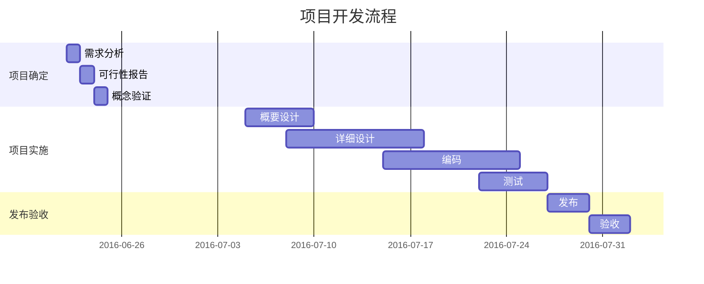

云计算平台的复杂结构以及不可忽略的硬件相关性，使得测试团队的构成，以及测试架构的设计变的与传统的Web测试非常的不同.
# 一、结构的复杂性
传统的BS架构的平台，无论是基于SpringCloud 还是其他的微服务架构。按照目前前后端分离的设计思想，都会由一个传统意义的前端 + 一个提供服务的后端构成。所有的测试会围绕着这两个大的部分：前端展示，值域范围。后端接口的业务逻辑处理。
但是云平台由于需要提供IAAS层的能力，所以不得不依赖于硬件设备，从设计的角度，物理层的管理也需要被抽象和隔离。那么云平台就额外多了两层，一个用来管理硬件的编排层，以及真正和硬件打交道的虚拟化层(这里用虚拟化层来概括，计算虚拟化，网络虚拟化，存储虚拟化)
# 二、技术的复杂性
从技术实现到测试方法，云计算平台由于其结构上的复杂性以及和硬件的特殊交互的方式，所以引入了各个领域的技术。仅仅采用传统的测试架构设计和测试方法，会由于各种因素的干扰，导致测试结果无法达到预期，增加质量风险。以传统的为服务架构的测试方法做对比:
1. 传统的微服务的框架的门户网站或者应用的主要涉及前端，微服务，数据库，中间件，以及必要的负载均衡技术，关联三方接口调用等等
   **这些技术和组件都是在标准的硬件基础上，不需要考虑硬件的因素，不用关心底层硬件的型号特性等等**
2. 云平台在上面技术的基础上，多了编排层和虚拟化层
   **由于云平台所提供的业务能力之一就是将硬件隔离，提供统一的资源池服务，所以云平台的虚拟化层不得不适配各种硬件型号带来的差异，如不同型号的CPU，不同型号的服务器，不同型号的交换机，不同型号的存储设备**
# 三、分层测试架构理念
从这些不同和复杂性出发，我们就需要考虑

---
**可以尝试加入一些代码比如`def randwrite()`**
